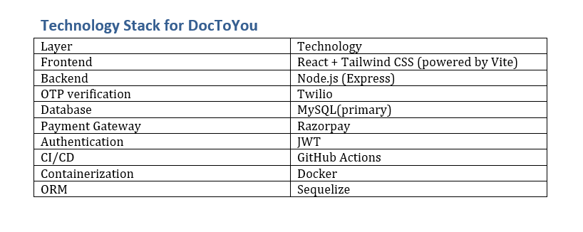

# Project : DocToYou

## SUMMARY 
This proposal outlines the plan to design and develop "DocToYou", a full-featured web 
application connecting patients with nearby doctors for in-person home visits. The platform 
will allow doctors to list their services, set their pricing, and accept appointments from patients. 
A 10% service fee will be charged on each successful consultation processed through the app. 
The project will be delivered over a 9-month timeline, covering frontend, backend, and 
deployment, optimized for MSME operations and budgets.
## Objective of the project

To build a web-based platform that connects patients with qualified doctors who offer in-home visits. The platform will serve as a two-sided marketplace:

- Doctors register, create profiles, and list services with custom pricing.
- Patients search, filter, and book doctors for at-home treatment.
- App facilitates secure payments, with a 10% service fee deducted per transaction.

## PROJECT SCOPE
### Platform Functionality
#### Doctor Features
- Sign-up and KYC/license verification
-	Profile creation with pricing, experience, and specializations
-	Appointment management dashboard
-	Earnings dashboard with payment history
-	Notifications for bookings and payments
#### Patient Features
- Sign-up and user profile
- Search for doctors by location, specialization, and availability
- View doctor profiles, reviews, and consultation fees
- Book appointments and make payments
- Receive appointment confirmation and reminders
#### Admin Panel
- User and doctor management
- Appointment and transaction monitoring
- Commission and payout control (10% deduction)
- KYC and profile approval system
- Content management and analytics

## project techstack (Planned)
### currently using

### Got to use

## Risk Mitigation 
- User Verification: Strict KYC processes for doctors. 
- Payment Security: PCI-DSS compliant gateway and SSL enforcement. 
- Scalability: Modular architecture with cloud-based infrastructure. 
- Delays: Built-in buffer time; agile sprint cycles for visibility. 

## Deliverables 
- Full web platform with doctor and patient interfaces 
- Admin portal with analytics and controls 
- Integrated payment and booking system 
- Secure database with patient/doctor data 
- Technical and user documentation 
