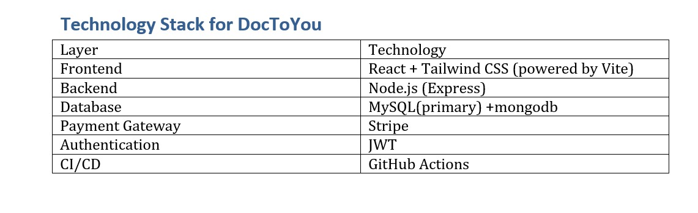

# DocToYou 🏥💻

**DocToYou** is a full-stack web application that connects patients with verified doctors for **home visit consultations**, **online appointments**, and **real-time doctor tracking**. It is designed to help elderly people, chronically ill patients, and busy families receive medical care from the comfort of their homes.

---

## 🚀 Project Overview

- 🔐 Doctor KYC Verification
- 📍 Real-time Doctor Location Tracking
- 📆 Appointment Booking & History
- ✅ Doctor Availability Toggle (Live Sync)
- 💬 Patient-Doctor Chat (Planned)
- 🧾 Admin Dashboard for Monitoring
- 🔔 Email/SMS Reminders (Optional)

---
## Project structure

mern-project/<br>
├── client/      <-- React <br>
│   ├── public/<br>
│   ├── src/<br>
│   ├── package.json<br>
│   └── ...<br>
├── server/            <- Backend<br>
│   ├── config/            
│   ├── controllers/       
│   ├── models/            
│   ├── routes/            
│   ├── app.js             
│   ├── server.js          
│   ├── .env              
│   └── package.json
├── .gitignore
├── README.md

## 🧠 Tech Stack

### Frontend
- React.js (with React Router) powered by vite
- Axios (for API calls)
- Tailwind CSS or Bootstrap (UI)

### Backend
- Node.js + Express
- MySQL / MySQL2
- (Optional: Sequelize ORM)

### Other Tools
- GitHub (Team Collaboration)
- Google Maps API (Location)
- Firebase/Socket.IO (Real-time features - planned)
- Google Calendar API (optional reminders)

---

## 🧑‍💻 Getting Started

### 1. Clone the Repo
```bash
git clone https://github.com/suryapugazh/doctoyou.git
cd doctoyou
git checkout your-assingned-branch
code .
```
### After your coding

```bash
git add .
git commit -m "Your detailed message on the code."
git checkout parent-branch
git merge your-assigned-branch
# after commiting resolve all possible conflicts.
```